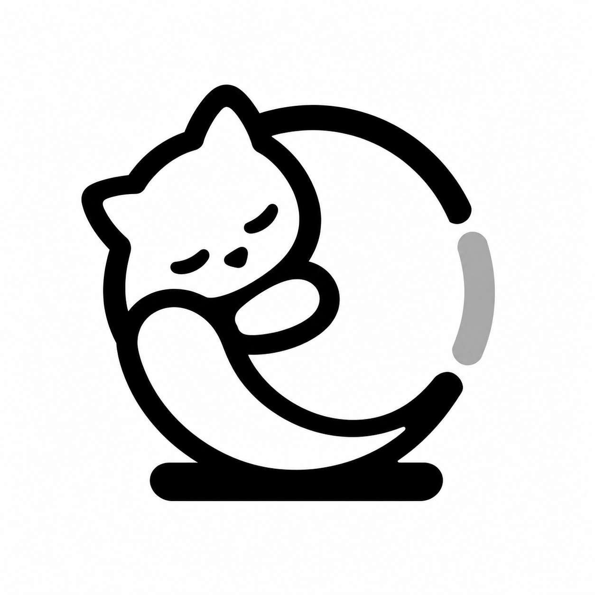

# QuotaNotch

AI quota, music and calendar in your MacBook notch. A focused fork of [Boring Notch](https://github.com/TheBoredTeam/boring.notch).

[简体中文](README.zh-CN.md) · [Builds](https://github.com/ApisXia/QuotaNotch/actions/workflows/quotanotch.yml) · [Releases](https://github.com/ApisXia/QuotaNotch/releases)

## Features

- Claude, Codex and Gemini CLI / Code Assist quota windows using locally signed-in CLI accounts. Gemini is optional; this is not monitoring the Gemini consumer web subscription.
- Pin one quota window. A compact ring shows remaining usage, with optional numbers. Music and quota share the notch: artwork with audio activity on the left, quota on the right.
- Fixed provider tabs, paged quota details and a fixed bottom toolbar. Paused providers disappear from the usage interface and pin choices.
- Music controls, calendar events and reminders. Enable the calendar in Settings → Calendar.
- English, Simplified Chinese or Follow system in Settings → General → Language. Restart to apply.
- Optional volume, brightness and battery indicators; hover, click and keyboard shortcut controls.

No Shelf, AirDrop, file sharing, camera mirror, lyric fetching, experimental swipe-to-open/close, open-notch HUD or custom Lottie animation editor. Full-screen hiding applies to all applications or can be disabled.

## Install

Requires **macOS 15+**, Apple Silicon or Intel. Download a QuotaNotch DMG from an available release or the latest successful workflow artifact. Workflow artifacts are ZIP files: extract the DMG first, then open it and drag **QuotaNotch.app** into Applications. Quit QuotaNotch before replacing an earlier version.

The app has a separate identity (`com.apisxia.quotanotch`) and does not replace Boring Notch. Quit the original while using QuotaNotch so both do not occupy the notch. Builds are ad-hoc signed and are not Apple notarized. Upstream automatic updates are disabled.

Sign in to the relevant CLI on this Mac, then enable monitoring in AI quota settings. Credentials remain local. Missing or stale quota is identified; no token totals, costs or unsupported model breakdowns are invented. Only enabled providers are polled.

## Build and verification

Use Xcode 26 and the `boringNotch` scheme in `boringNotch.xcodeproj`; the product is **QuotaNotch.app**. `swift test --parallel` runs account-free core fixtures. The macOS workflow builds both architectures, validates English/Chinese resources, renders native UI fixtures, verifies signatures and packages a DMG together with the matching source and license notices.

Real notch placement, playback, calendar permissions and live account responses still require testing on a Mac. Native preview images use fixture data.

## License and credits

This fork retains the upstream **GPL-3.0** license: see [LICENSE](LICENSE) and [THIRD_PARTY_LICENSES](THIRD_PARTY_LICENSES). Original copyright and third-party notices remain intact. The sleeping-cat quota icon is the selected original QuotaNotch artwork; its production source is in `docs/assets`. Provider marks identify their respective services.
