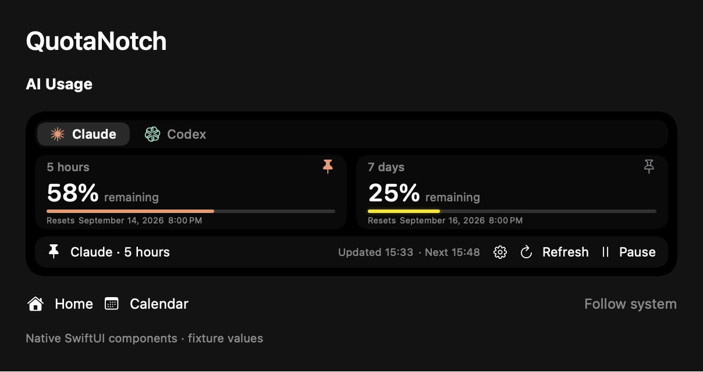

# QuotaNotch

AI quota, coding task activity, music and calendar in your MacBook notch.

[简体中文](README.zh-CN.md) · [Download](https://github.com/ApisXia/QuotaNotch/releases) · [Builds](https://github.com/ApisXia/QuotaNotch/actions/workflows/quotanotch.yml)

Native UI preview with sample data.

- Optional pixel cat, off by default; enable it in settings and rub a notch edge to invite it out.
- Unified task status icons and a Read all action; independent wing sizing keeps music anchored.
- Claude, Codex and optional Gemini CLI / Code Assist quota.
- Follow local Codex and Claude Code tasks across projects, with source labels and approval-wait awareness.
- Pin one quota beside music and task activity. Click widgets to open their panels; swipe across the open header to change pages.
- Keep read task history for 1 hour, 5 hours (default), or 1 day.
- Low quota gradually turns yellow, then red, with a subtle glow.
- Calendar, reminders, English and Simplified Chinese.

**macOS 15+ · Apple Silicon & Intel.** Open the DMG and drag QuotaNotch into Applications. Sign in to your CLI, then enable AI monitoring in settings. Updates currently install manually; builds are not Apple notarized.

[Usage and build guide](docs/Guide.md) · [GPL-3.0](LICENSE) · [Third-party notices](THIRD_PARTY_LICENSES)

Based on [Boring Notch](https://github.com/TheBoredTeam/boring.notch).
