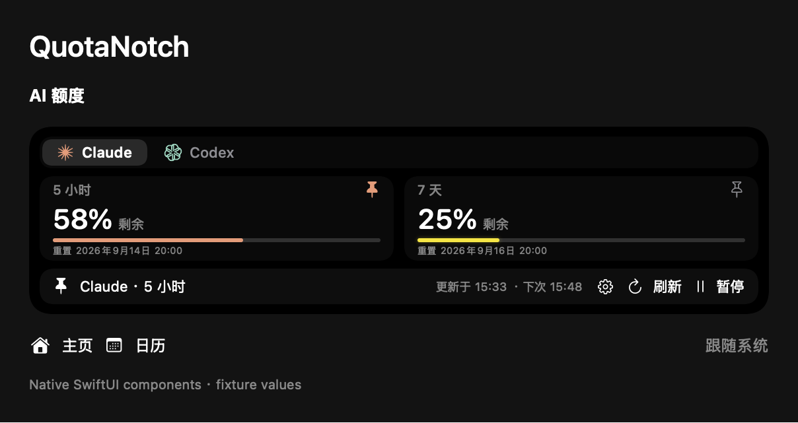

# QuotaNotch

在 MacBook 刘海中查看 AI 额度、控制音乐和查看日历。

[English](README.md) · [下载](https://github.com/ApisXia/QuotaNotch/releases) · [构建附件](https://github.com/ApisXia/QuotaNotch/actions/workflows/quotanotch.yml)

原生界面预览，使用示例数据。

- 支持 Claude、Codex 和可选的 Gemini CLI / Code Assist 额度。
- 固定一个额度与音乐共享刘海：悬停左边看音乐，右边看额度。
- 额度不足时逐渐变黄、变红，并带轻微光晕。
- 保留日历、提醒事项，支持中文与英语。

**macOS 15+，支持 Apple Silicon 和 Intel。** 打开 DMG，拖入「应用程序」。先登录本机 CLI，再在设置中启用 AI 监控。当前手动更新，安装包尚未 Apple 公证。

[使用与构建说明](docs/Guide.zh-CN.md) · [GPL-3.0](LICENSE) · [第三方许可](THIRD_PARTY_LICENSES)

基于 [Boring Notch](https://github.com/TheBoredTeam/boring.notch)。
